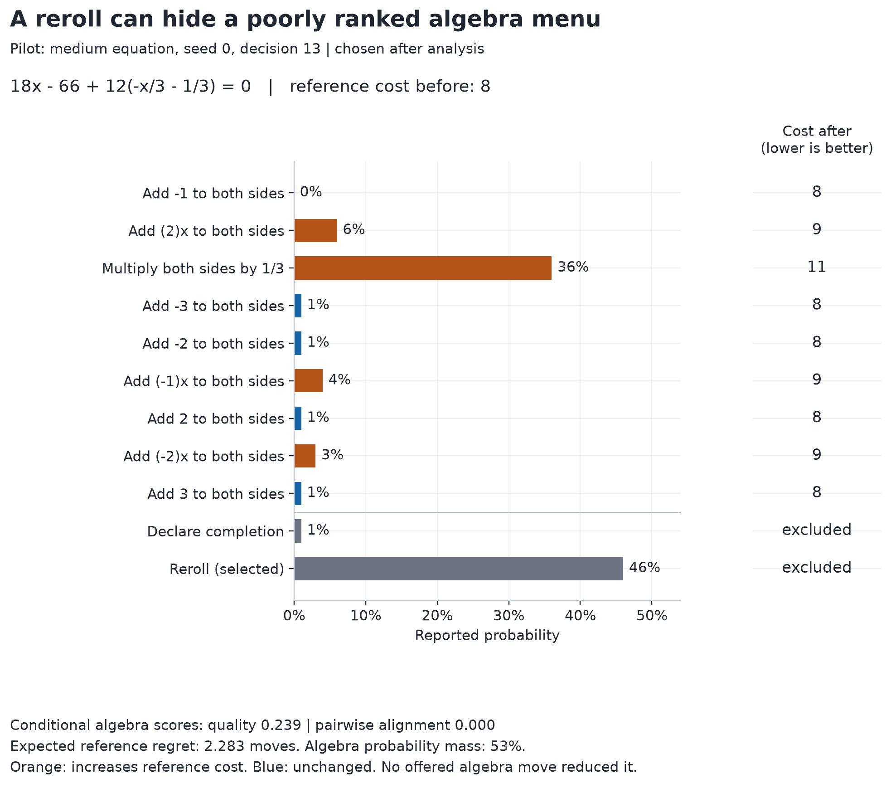
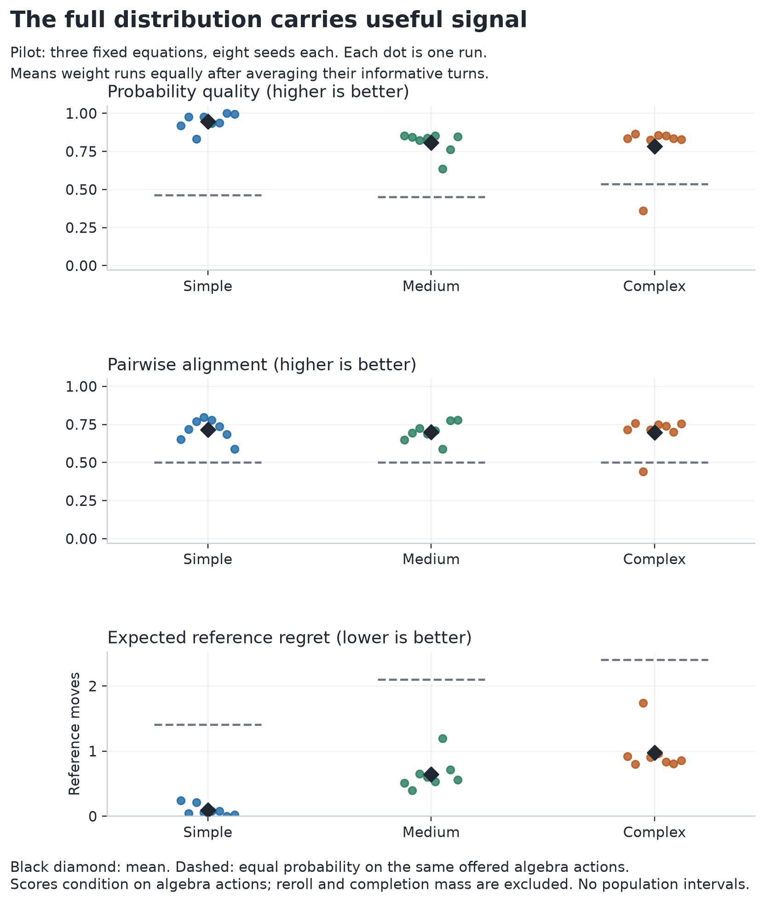
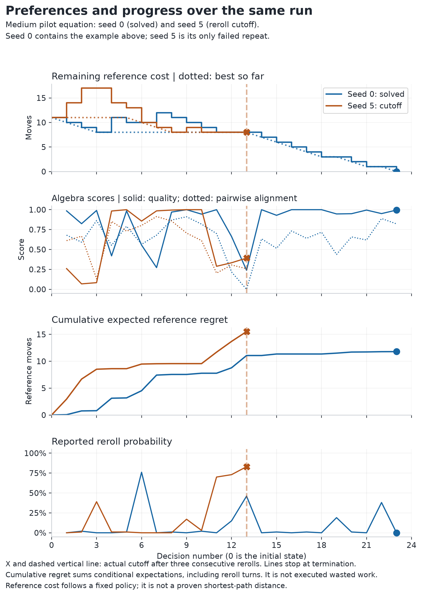
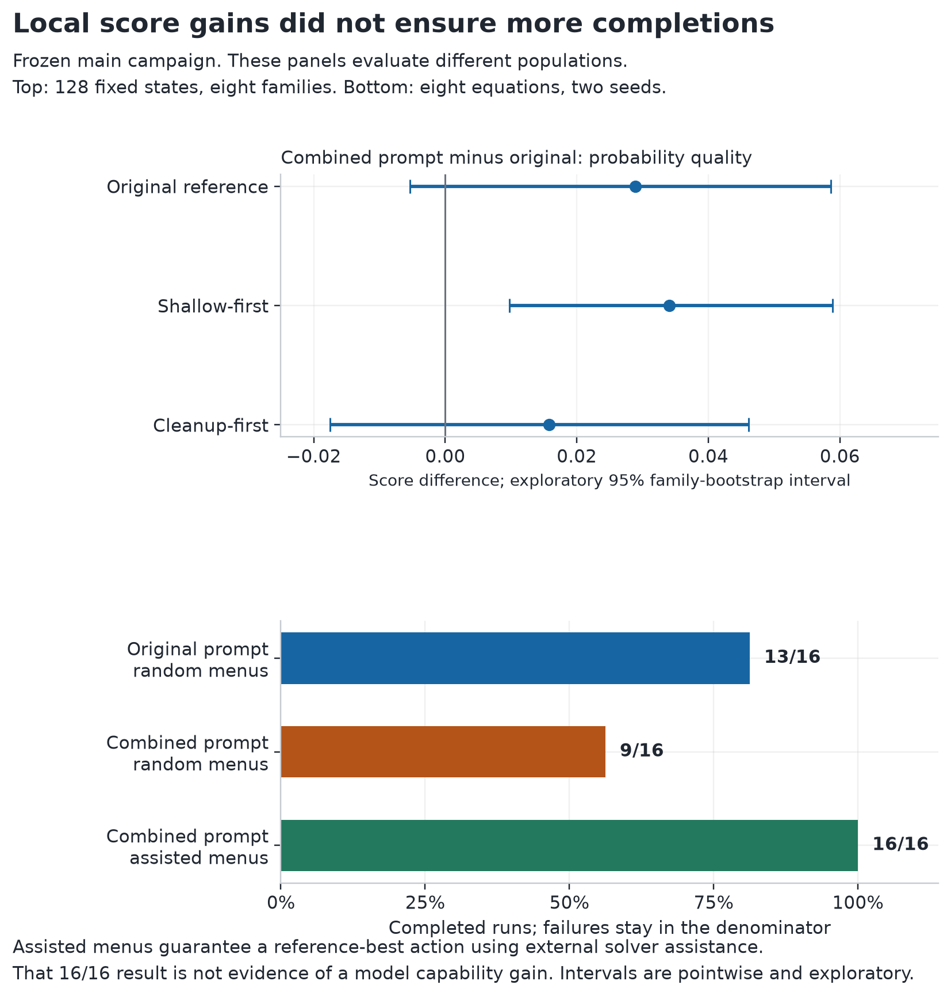

I wanted to know whether [Jev](https://openrouter.ai/typesafe/jev-1.13) could choose what to do next inside a larger system. I was thinking about a research agent picking its next search, or a coding agent choosing a tool. Algebra gave me a place to examine that decision process with exact, inspectable consequences.

My setup deliberately supplied help. Jev received ten legal actions plus a reroll. The prompt explained what each operation did and why it might help. Exact software performed the arithmetic. I wanted to test the selector with a usable interface. Repeated-state checks and reroll limits stopped it from going in circles indefinitely.

The pilot used three equations of increasing complexity, with eight seeds each. The middle one began as:

$$
\frac{3}{4}(2x-5)-\frac{1}{3}(x+1)=\frac{7}{4}.
$$

Its first menu included distributing the factor outside a bracket. Other options added a constant to both sides or multiplied both sides by a nonzero number. The [saved requests](https://github.com/NagyErvin-ZY/jev-action-selection-study/tree/v1.1.0) retain the full instructions and exact expression structure.

## Score every move it could have chosen

The idea I became most interested in was the probability distribution. Jev returned a probability for every option. Because I controlled the environment, I could execute **every offered algebra action on a copy of the same state**, including the moves it did not choose.

For each resulting equation, a fixed solver counted its remaining operations. I call that count **reference-policy completion cost**, $D$. It is deterministic, but it is not generally a proven shortest path.

That gave me a way to compare the model's preferences with the consequences of its alternatives. I used two complementary scores:

- **Probability quality:** how much probability favoured the better end of the offered menu. First calculate expected regret, $R=\sum_a p_a(d_a-d_{\min})$, where $d_a$ is the reference cost after action $a$. Quality is $1-R/(d_{\max}-d_{\min})$.
- **Pairwise alignment:** compare every pair with different costs. An ordering scores 1 when the better move receives more probability and 0 when the ordering is reversed. Probability ties score 0.5. Each pair is weighted by its reference-cost gap.

These answer different questions. Almost all probability can sit on a good move while tiny-probability alternatives are poorly ranked. Expected regret also retains a useful unit: reference moves above the best offered action.

I excluded reroll and completion declarations, then renormalised the algebra probabilities. Their excluded mass remains visible. These conditional preference scores do not establish probability calibration. Action costs also do not define a uniquely correct target distribution over choices.

[Open this chart at full size](figures/decision-distribution.svg).

*An illustrative turn selected after analysis. The chart shows original reported probabilities; scoring conditions on the 53% assigned to algebra actions.*

Here Jev chose reroll with probability 46%. Among algebra choices, multiplying both sides by $1/3$ received **67.9% of the conditional mass**, although it raised reference cost from 8 to 11. Several alternatives kept the cost at 8. Pairwise alignment was zero: every unequal-cost pair was reversed.

No offered algebra action immediately reduced reference cost. The reroll avoided executing that multiplication, and the run eventually finished. Looking only at the executed action or eventual answer would hide the preference pattern.

## Follow the preferences through a run

Across the pilot I scored **689 turns, 6,590 counterfactual actions and 20,915 unequal-cost pairs**. Averaging within each run and then weighting runs equally gave probability quality **0.845** and pairwise alignment **0.705**. Expected reference regret was **0.572 moves**, versus **1.971** for equal probability on the same offered algebra actions.

[Open this chart at full size](figures/distribution-summary.svg).

*Each dot is a run. The comparison uses the exact menus at visited states. Three equations with repeated seeds remain three problems; the dots are not independent evidence of broad algebra ability.*

I also wanted to see what accumulated: whether the equation got closer to completion as the distribution changed. The stopping point needed to remain visible.

[Open this chart at full size](figures/progress-and-preferences.svg).

*Seed 0 contains the example above. Seed 5 is the only failed repeat of the same equation. Dotted best-so-far cost exposes regressions; the orange X marks termination after three consecutive rerolls. All pilot runs remain inspectable in the evidence archive.*

The cumulative regret line sums conditional expectations, including on reroll turns. It does **not** count executed wasted moves. Keeping it beside actual progress makes that distinction inspectable. A good conditional score can coexist with a weak menu. Repeated rerolls can still end the run without a solution.

## Investigate where it breaks

The next experiments varied problem structure and prompting to locate the source of the difficulty. The side tests changed option order and replaced labels with words drawn from a 100-word pool. I mapped these back to the same actions before comparing responses.

The frozen main campaign added 128 states from eight equation families and 24 saved pilot states. Its initial complete-run comparison used eight new equations with two seeds each.

[Open this chart at full size](figures/local-scores-and-completion.svg).

*Top: fixed-state evaluations, with exploratory intervals resampling eight families. Bottom: separate complete trajectories. Failed runs remain in every denominator.*

The combined prompt replaced equation text with a node table. It also removed generic benefit claims from action descriptions and added strategy guidance. Its local gains depended on the evaluator; complete runs fell from **13/16 to 9/16**. Ensuring a reference-best move appeared in each menu brought completion to **16/16**. That supplied external solver assistance. It did not demonstrate an increase in model capability.

The later, exploratory prompt follow-up associated our particular node-table representation with **26.6 percentage points lower completion**, averaging the other factors. Two combinations were collected earlier than the other six, leaving collection-phase confounding. On the 16 fresh side-test states, reversing option order changed the selected action in **18.75%** of repeat comparisons; random-word labels alone gave **6.25%**.

I also had to check the measuring instrument. An apparent outer-expansion weakness changed substantially under different reference strategies. Bounded searches on eight targeted near-completion cases established five suboptimal decisions. One reference flag was a false positive; two cases remained unresolved. The [appendix](https://github.com/NagyErvin-ZY/jev-action-selection-study/blob/v1.1.0/docs/APPENDIX.md) keeps the initial interpretation beside its correction.

## What I would take into another system

I still see a use worth testing for a cheap action selector. I would give it an interface that explains its options and supplies worthwhile candidates, then check the outcome of each choice.

For research navigation, I would test whether a selected search resolves a stated evidence gap. For coding, I would test tool choices against observable progress. This algebra experiment did not demonstrate either application. It gave me a way to inspect preferences and a reason to evaluate whole trajectories before trusting those preferences as a controller.

The study cost approximately **$0.54**, or **$0.61 including the pilot**, on 19 September 2026. The [versioned repository](https://github.com/NagyErvin-ZY/jev-action-selection-study/tree/v1.1.0) preserves the underlying evidence and offline reproduction. Its appendix documents each collection phase separately and discloses AI-assisted implementation and drafting. Verification used programmatic checks and separate agent review.
