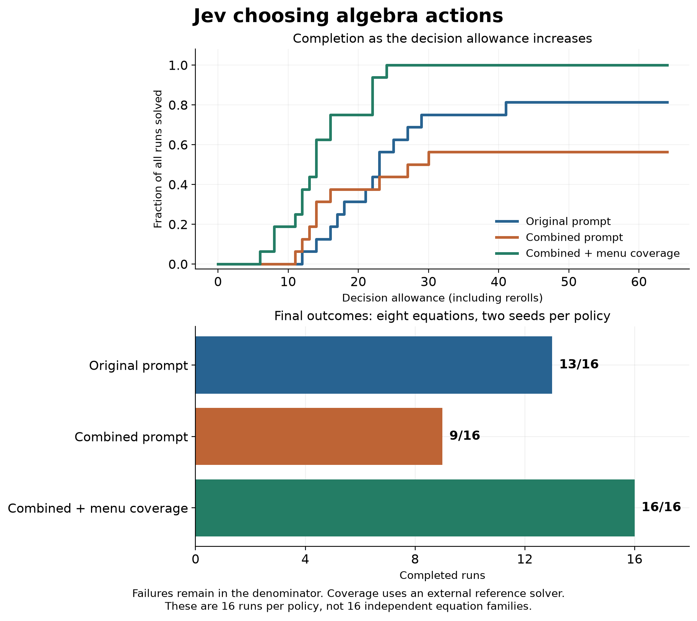

I wanted to see whether [Jev](https://openrouter.ai/typesafe/jev-1.13), TypeSafe's structured decision model, could steer a task through several steps. Algebra gave me a small environment where I could inspect every move and check the result exactly.

Jev selected operations. A deterministic engine performed the arithmetic. Each decision offered ten sampled actions and a reroll, with explanations of what each action did. The engine detected completion. Limits on repeated states and stalled progress prevented a run from continuing indefinitely.

One starting equation was `6(2x + 5) = 65`, stored with an extra grouping node. Its first menu included these options, shown here as shortened excerpts:

| Action | Description |
|---|---|
| Remove redundant grouping | Remove an unnecessary single-term sum on the left |
| Add −65 to both sides | Preserve equality and combine an existing constant |
| Multiply both sides by 1/2 | Preserve solutions without automatically expanding brackets |
| Reroll | Keep the equation and draw another menu |

The [repository](https://github.com/NagyErvin-ZY/jev-action-selection-study/tree/v1.0.0) contains the full requests, including the less useful choices.

## The menu changed the outcome

I measured both individual decisions and complete runs. For a decision, I applied every offered algebra action to a copy of the equation, then calculated the remaining **reference-policy completion cost** under a fixed solver strategy. This let me score how Jev distributed probability across better and worse moves.

The score applies only to algebra operations. Reroll and premature completion are excluded. Jev's probabilities are not calibrated probabilities of successfully finishing the task.

The main experiment used 128 generated states from eight equation families, alongside 24 saved states from the pilot. For complete runs, I used eight new equations with two seeds each.

Three policies were fixed before those runs:

| Policy | Completed |
|---|---:|
| Original prompt, random menus | **13/16** |
| Combined prompt changes, random menus | **9/16** |
| Combined prompt changes, reference-best move included | **16/16** |

The combined prompt replaced ordinary equation text with a node table. Its action descriptions omitted generic benefit claims, and it supplied additional strategy guidance. It improved some local probability scores, but completed fewer runs. The fixed-state measurements and trajectories are different tests; a gain in one did not establish a gain in the other.

For the third policy, the controller ensured that each menu contained a move with the best reference-policy score. Jev still chose the action. That was external solver assistance, and it changed the observed completion rate substantially.

[View the full-size figure](https://raw.githubusercontent.com/NagyErvin-ZY/jev-action-selection-study/v1.0.0/docs/figures/article-completion.png).

The figure retains failed runs in the denominator. Stopping early because a run is stuck cannot count as solving quickly. The supported-menu result leaves the model’s added value unresolved when software can already rank the actions effectively.

## Presentation mattered too

After seeing the initial results, I ran the six remaining combinations of the prompt changes on the same equations. Across the eight combinations, enabling our node-table representation was associated with a 26.6 percentage-point lower completion rate. Seven equations worsened and one tied when averaging the other factors and repeats.

This was a later, exploratory follow-up. Two prompt combinations came from the earlier batch, so collection phase is confounded with some interaction estimates. The observation concerns this particular replacement for ordinary equation text. It does not establish that structured prompts generally hurt.

Option order also changed decisions. On 16 fresh states used for side tests, reversing the options produced an average choice-change rate of 18.75% across repeat comparisons. Random-word labels alone produced 6.25%. Both comparisons map labels back to the underlying actions.

These findings make me want to inspect presentation stability before using a selector in a longer workflow. They do not tell me which internal mechanism caused the changes.

## What I would try next

Bounded research navigation is one application I would test: offer distinct searches addressing an evidence gap, then record whether the selected search adds useful evidence. Tool selection inside a coding agent is another possibility, where tests can check the consequences of a choice.

Those uses need their own evaluations. The surrounding system supplied legal actions with exact feedback in this experiment. Research has a much harder evidence-quality problem. A cheap selector can still choose an expensive, unhelpful action, so the useful economic measure would be total cost per completed task.

## Evidence and reproduction

The study made 6,025 model requests on 19 September 2026. It cost **0.54 USD**. Including the pilot brings spending to **0.61 USD**. Eight families remain a small sample; repeated decisions do not create independent problems.

The [technical appendix](https://github.com/NagyErvin-ZY/jev-action-selection-study/blob/v1.0.0/docs/APPENDIX.md) includes all treatments and scoring definitions. It also documents an evaluator-dependent diagnosis that I corrected. The versioned repository preserves the evidence and provides offline reproduction of the reported results, with AI assistance disclosed in the methods.
